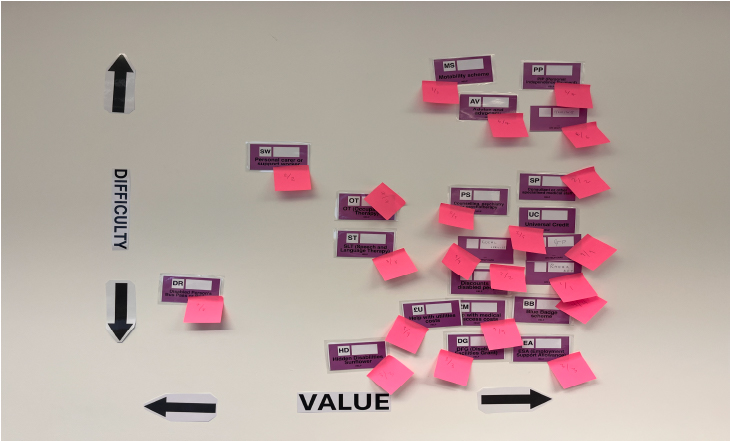
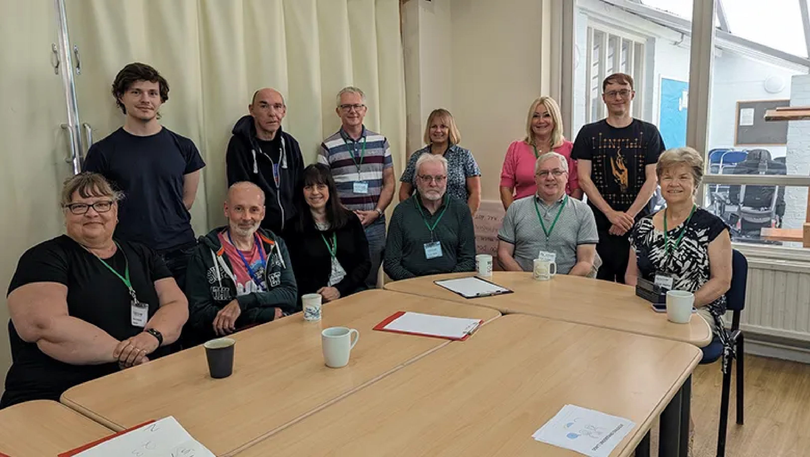

# Filips Corner

## Local preview without touching `main`

You can experiment with the Theme Lab and the rest of the site entirely on your machine:

1. Clone or download this repository somewhere on your computer (see “Downloading the files” below for step-by-step options).
2. Open a terminal (or the built-in Sublime Text console) and change into the project folder.
3. Start a lightweight web server:
   ```bash
   python3 -m http.server 8000
   ```
   The command ships with Python, so there is nothing extra to install. (On Windows you can run the same command in PowerShell.)
4. Visit <http://localhost:8000/index.html> in your browser. Every time you save a file, refresh the page to see your changes instantly.

### Optional auto-refresh
If you prefer live reloading, install a simple dev server (once):
```bash
npm install -g live-server
```
Then launch it inside the project directory with:
```bash
live-server
```
The page will refresh automatically whenever you save edits in Sublime.

### Using the built-in Theme Lab
- The Theme Lab now lives inside a collapsible “Personalise the theme” panel at the top of the home page so it stays out of the way for most visitors, and the previous `:root {…}` CSS preview is removed so nothing extra shows up on load.
- Preset palettes are tuned for common colour-vision differences (tritan, deutan, and a dark high-contrast option). Manual tweaks via the colour pickers automatically switch the preset menu to **Custom** so you know you are on a bespoke combination.
- The selections are stored in the browser’s `localStorage`, meaning each visitor keeps their own preferences without affecting anyone else.

### Locking in a palette for `main`
Once you are happy with a colour/font combination and want to make it the permanent theme:

1. Open your browser’s developer tools console while the Theme Lab shows the palette you want to keep.
2. Run the snippet below to print the current design tokens so you can copy/paste them:
   ```js
   const tokens = ['--brand','--brand-soft','--text','--bg','--surface','--surface-alt','--border','--muted','--shadow','--shadow-soft','--shadow-hover'];
   const styles = getComputedStyle(document.documentElement);
   tokens.forEach(name => console.log(`${name}: ${styles.getPropertyValue(name).trim()};`));
   console.log('--font-body:', styles.getPropertyValue('--font-body').trim());
   console.log('--font-heading:', styles.getPropertyValue('--font-heading').trim());
   ```
3. Paste the output over the existing `:root { ... }` block at the top of `style.css`, and make sure any one-off colours in other components reference those variables for consistency.
4. If you no longer want visitors to adjust the theme, remove the `<section class="theme-lab">…</section>` block from `index.html`, delete the “Theme laboratory” IIFE from `script.js`, and prune the related CSS rules.

### Editing tips for Sublime Text
- Open the entire `filips_corner` folder in Sublime so you can switch between `index.html`, `style.css`, and `script.js` quickly.
- Save often—your local server will pick up the changes immediately on refresh.
- None of these steps modify the GitHub `main` branch; they only affect the files on your machine until you decide to commit and push.

### Using the provided Codespace/Dev Container
If you are working inside the GitHub-provided environment, run the same Python server command above. You can then forward port `8000` and open the preview in your browser.

## Downloading the files

There are three easy ways to grab a copy of the site so you can keep it on your computer:

1. **Download a ZIP from GitHub**
   1. Visit <https://github.com/filip-bircanin/filips_corner> in your browser.
   2. Click the green **Code** button and choose **Download ZIP**.
   3. Unzip the archive somewhere convenient (e.g., your Desktop) and open that folder in Sublime.
2. **Clone with Git** (keeps the history and makes it easy to pull updates):
   ```bash
   git clone https://github.com/filip-bircanin/filips_corner.git
   ```
   Run the command in Terminal / PowerShell, then open the new `filips_corner` folder in Sublime.
3. **Copy files out of this Codespace or container** if you are experimenting here:
   1. Run `zip -r filips_corner.zip .` inside the repository root to package everything.
   2. Use the Codespace/VS Code “Download…” command (or your terminal’s download feature) to pull `filips_corner.zip` to your machine.
   3. Unzip locally.

Once you have the files locally, you can follow the preview steps above without affecting the GitHub `main` branch.

## Finding the hoverable project cards

The two project tiles that animate on hover are still part of `index.html`. They live in the `<!-- ========== PROJECTS ========== -->` section near the bottom of the file and start with the `<section id="projects">` element (around lines 130–170). Each tile is an `<a>` with the `project-quadrant` class.

If you want to copy or restore the exact markup, take the entire block:

```html
<section id="projects">
  <h2>Projects</h2>
  <div class="projects-grid">
    <a href="projects.html" class="project-quadrant">
      
      <div class="project-info">
        <h3>"Computer Says No"</h3>
        <p>We are making public service system more accessible.</p>
      </div>
    </a>
    <a href="projects.html" class="project-quadrant">
      
      <div class="project-info">
        <h3>Sounds Accessible</h3>
        <p>Together with BBC R&amp;D and post-stroke survivors we design accessible media technologies.</p>
      </div>
    </a>
  </div>
  <p class="see-all">
    <a href="projects.html">See all projects →</a>
  </p>
</section>
```

The hover styling that lifts each tile lives in `style.css` under the “Publications & Projects blocks” heading. The key rules are the `.project-quadrant` selectors—make sure those styles are present anywhere you paste the HTML so the hover animation shows up.
